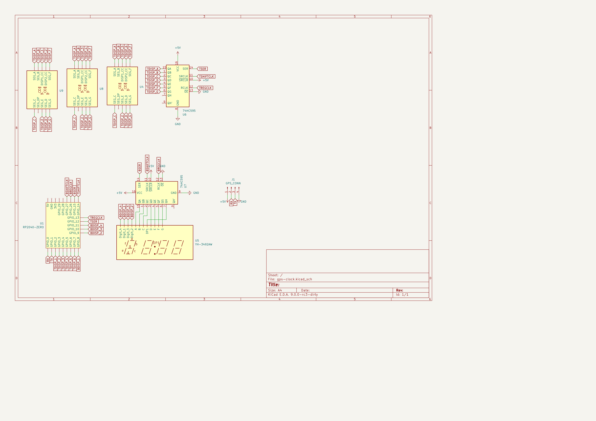
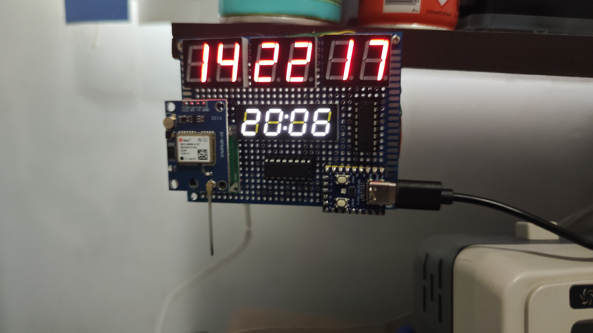

# gps-clock
A simple gps clock based on a Waveshare RP2040 board and a Neo M8N gps module, the displays are 3 5621AS common cathode 2 bit red displays and the YH-3492AW 4 bit white display driven by 2 74HC595 shift registers.

Schematics:

Result (the bottom display does not have ghosting, its just the camera and the fact it leaks a little bit of light between segments):

